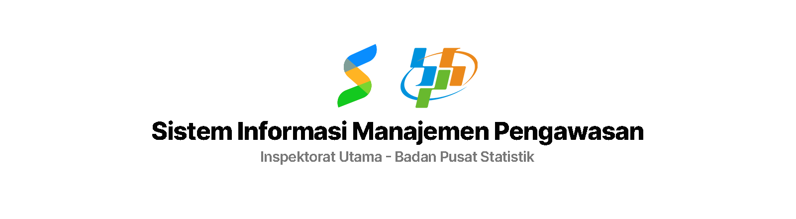

## Sistem Informasi Manajemen Pengawasan

Sistem Manajemen Pengawasan adalah aplikasi berbasis web yang dibangun untuk membantu pengawasan dan manajemen kinerja pegawai. Aplikasi ini terdiri dari beberapa modul yang dirancang untuk berbagai aspek manajemen, termasuk:

1. **Modul Perencanaan dan Realisasi Kinerja Pegawai**

    - Modul ini digunakan untuk membuat rencana kerja pegawai dan melacak realisasi kinerja pegawai.
    - Kelengkapan Tugas Tim (Surat Tugas, Norma Hasil, Kendali Mutu)
    - Usulan Surat

2. **Modul Pegawai**

    - Digunakan untuk pengelolaan data, kompetensi, pelaporan dan evaluasi kinerja pegawai.
    - Kelengkapan Tugas Pegawai

3. **Modul Unit Kerja**

    - Berisi penetapan target, realisasi, dan evaluasi kinerja unit kerja.

### Teknologi Stack

-   Laravel - PHP Framework
-   MariaDB/MySQL - Database
-   Bootstrap - Frontend Framework
-   jQuery - JavaScript Library
-   DataTables - Table Plugin
-   Font Awesome - Icon Library

### Instalasi

Berikut adalah langkah-langkah untuk memulai development aplikasi:

1. Clone repositori ini ke komputer lokal Anda.

    ```bash
    git clone [url]
    cd [folder]
    ```

2. Copy file `.env.example` menjadi `.env` dan sesuaikan konfigurasi database dan Google Client ID.

    ```bash
    cp .env.example .env
    ```

3. Jalankan script `setup.sh` untuk menginstall dependensi dan mengkonfigurasi aplikasi.

    ```bash
    ./setup.sh
    ```

## Lisensi

Aplikasi ini dilindungi oleh [Hak Cipta (c) 2024](https://dgip.go.id/menu-utama/hak-cipta/pengenalan) oleh [Politeknik Statistika](https://stis.ac.id).
